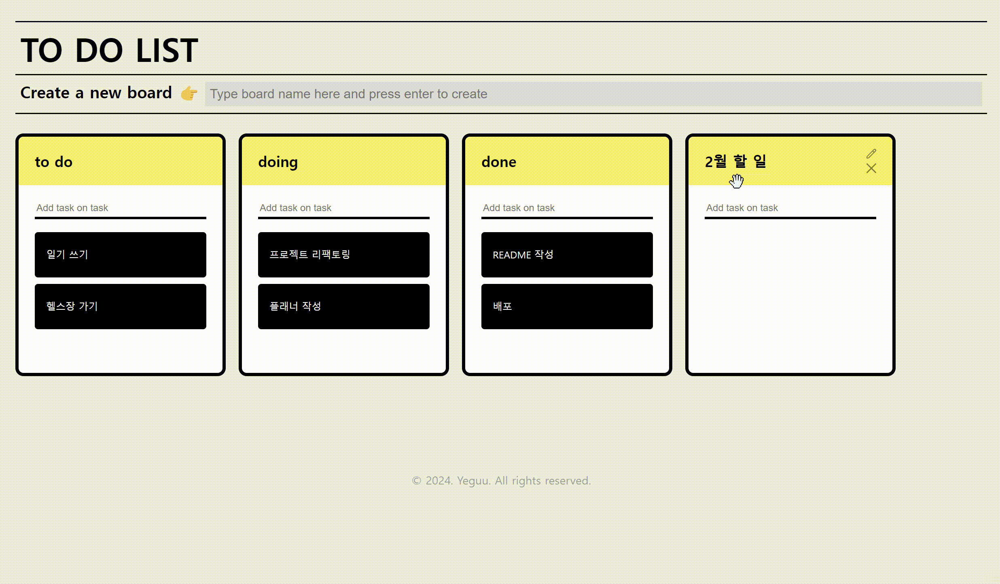

# To Do List

## Overview

[](https://yyyrin.github.io/to-do-list/)

`react-hook-form`과 `react-beautiful-dnd`를 활용하여 **board**와 **to-do**를 손쉽게 생성하고, 드래그 앤 드롭을 통해 편리하게 관리할 수 있는 작업 관리 애플리케이션입니다.

#### 배포 주소: [https://yyyrin.github.io/to-do-list/](https://yyyrin.github.io/to-do-list/)

<br/><br/>

## 주요 기능

#### Board 및 To-Do 관리


- `Recoil`을 활용하여 **board**와 **to-do**의 실시간 생성 및 업데이트 구현
- `react-hook-form`을 사용하여 폼을 구성하였고, 엔터 키를 통해 **board**와 **to-do** 생성 가능

<br/>

#### 드래그 앤 드롭 기능


- `react-beautiful-dnd`를 활용하여 드래그 앤 드롭으로 **board**의 순서를 바꾸거나, **to-do**를 다른 **board**로 이동하거나 같은 **board** 내에서 다른 위치로 이동 구현

<br/>

#### 수정과 삭제 기능



- **board** 제목 옆의 수정 아이콘을 클릭하여 수정 모드로 전환하면, 제목을 수정한 후 엔터 키를 누르면 변경된 제목이 즉시 저장됨
  - **to-do**도 동일하게 수정 가능
- **board** 제목 옆의 삭제 아이콘을 클릭하여 해당 **board** 삭제 가능
  - **to-do**도 동일하게 삭제 가능
- **to-do**를 드래그하면 휴지통 아이콘이 표시되고, 휴지통 아이콘에 **to-do**를 드롭하면 해당 **to-do**가 삭제됨

<br/>

#### 로컬 스토리지와 동기화

- `localStorage`에서 데이터를 가져오거나 저장하여 사용자가 앱을 닫았다가 다시 열어도 이전 상태를 유지
- `Recoil` 상태가 변경될 때마다 자동으로 `localStorage`와 동기화

<br/><br/>

## Tech Stack

- React
- TypeScript
- styled-components
- Recoil
- Vite
- React Hook Form
- react-beautiful-dnd
- lottie-react

<br/><br/>

## Quick start

```bash
git clone https://github.com/yyyrin/to-do-list.git
npm install
npm run dev
```
